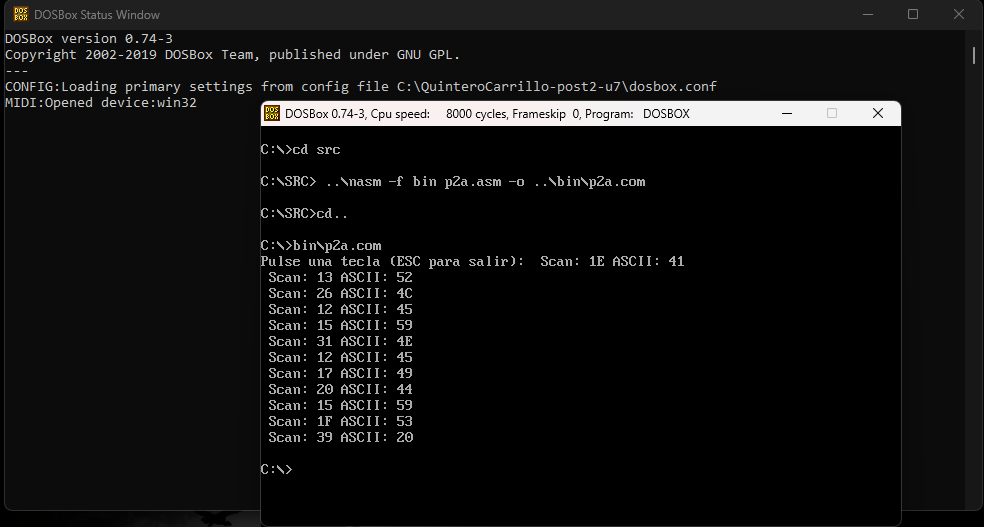
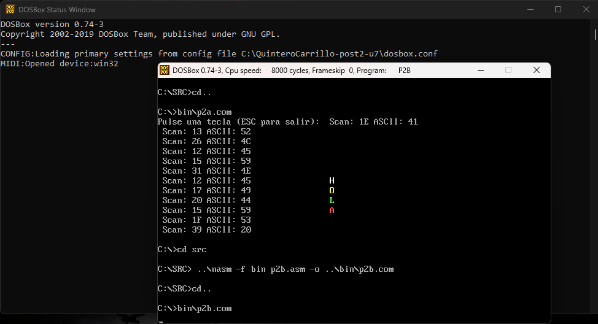
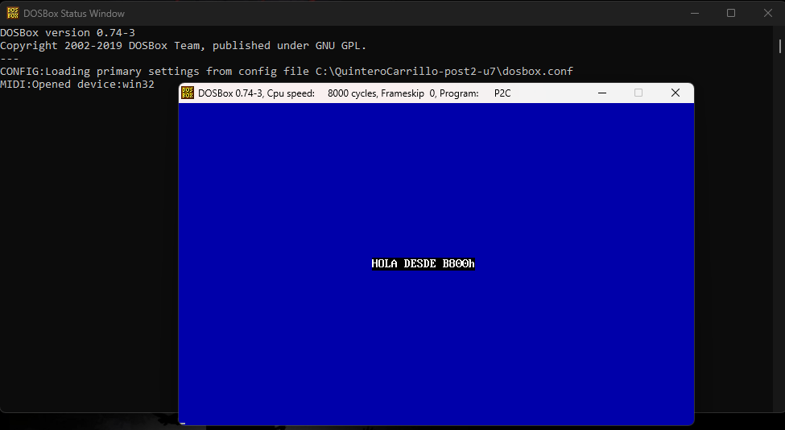
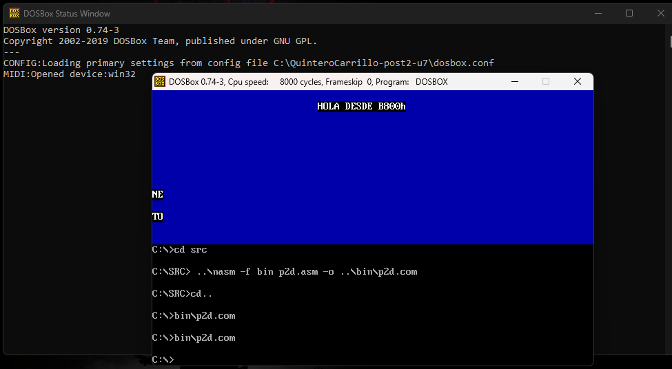

# Laboratorio 7 — INT 16h y Acceso Directo a B800h

**Estudiante:** Neidys Mariana Quintero Carrillo 
**Código:** 1152447
**Curso:** Arquitectura de Computadores  
**Programa:** Ingeniería de Sistemas  
**Universidad:** Francisco de Paula Santander  
**Año:** 2026  

---

## Descripción del laboratorio

Este laboratorio implementa programas en ensamblador x86 que leen el teclado
mediante INT 16h distinguiendo scan codes y caracteres ASCII, y que escriben
directamente en el segmento de video B800h para controlar texto y color en
pantalla sin pasar por interrupciones del BIOS, ejecutando los programas en
DOSBox con NASM.

---

## Entorno utilizado

| Componente | Versión / Detalle |
|---|---|
| Sistema operativo anfitrión | Windows [10/11] |
| DOSBox | 0.74-3 |
| NASM para DOS | 2.07 (Jul 19 2009) |
| CWSDPMI | csdpmi5b |
| Editor de texto | Notepad++ |

---

## Estructura del repositorio
```
QuinteroCarrillo-post2-u7/
├── src/
│   ├── p2a.asm    # Programa 1: lectura de scan codes con INT 16h
│   ├── p2b.asm    # Programa 2: escritura directa HOLA en B800h
│   ├── p2c.asm    # Programa 3: limpiar pantalla con REP STOSW
│   └── p2d.asm    # Programa 4: mini editor INT 16h + B800h
├── bin/
│   ├── p2a.com
│   ├── p2b.com
│   ├── p2c.com
│   └── p2d.com
├── capturas/
│   ├── cp1_p2a.png    # Checkpoint 1: scan codes en pantalla
│   ├── cp2_p2b.png    # Checkpoint 2: HOLA con colores en B800h
│   ├── cp3_p2c.png    # Checkpoint 3: pantalla azul con REP STOSW
│   └── cp4_p2d.png    # Checkpoint 4: mini editor funcionando
├── dosbox.conf
└── README.md
```
---

## Arquitectura del acceso directo a video B800h

En modo texto 80×25 el adaptador VGA mapea los caracteres en el segmento
B800h. Cada celda ocupa 2 bytes consecutivos:

| Byte | Contenido |
|---|---|
| Byte par (offset+0) | Código ASCII del carácter |
| Byte impar (offset+1) | Byte de atributo (fondo/texto) |

La fórmula para calcular el offset de cualquier celda es:
```
offset = (fila × 80 + columna) × 2
```

Ejemplos usados en el laboratorio:

| Fila | Columna | Cálculo | Offset |
|---|---|---|---|
| 10 | 35 | (10×80+35)×2 | 1670 |
| 11 | 35 | (11×80+35)×2 | 1830 |
| 12 | 35 | (12×80+35)×2 | 1990 |
| 13 | 35 | (13×80+35)×2 | 2150 |
| 12 | 30 | (12×80+30)×2 | 1980 |

---

## Tabla de funciones INT 16h utilizadas

| Función (AH) | Descripción | Retorno |
|---|---|---|
| 00h | Leer tecla (esperar) | AH=scan code, AL=ASCII |
| 01h | Verificar si hay tecla | ZF=1 si no hay tecla |

---

## Tabla de scan codes verificados

| Tecla | Scan Code (AH) | ASCII (AL) |
|---|---|---|
| Esc | 01h | 1Bh |
| Enter | 1Ch | 0Dh |
| A | 1Eh | 61h |
| Flecha ↑ | 48h | 00h |
| Flecha ↓ | 50h | 00h |
| F1 | 3Bh | 00h |

---

## Descripción de cada programa

### Programa 1 — p2a.asm: Lectura de scan codes
Lee teclas en bucle usando INT 16h función 00h. Guarda el scan code en
BL y el ASCII en BH. La subrutina impHex convierte un byte a dos dígitos
hexadecimales separando los nibbles alto y bajo. El programa termina al
detectar scan code 01h (Escape).

### Programa 2 — p2b.asm: Escritura directa en B800h
Apunta ES al segmento B800h y calcula el offset de cada celda usando la
fórmula (fila×80+columna)×2. Escribe las letras H, O, L, A en filas
consecutivas con atributos de color distintos sin usar ninguna interrupción
del BIOS para la salida visual.

### Programa 3 — p2c.asm: Limpiar pantalla con REP STOSW
Usa la instrucción STOSW con prefijo REP para rellenar las 2000 celdas
de la pantalla (80×25) con el valor 1720h (espacio con atributo azul/blanco)
en un solo barrido de memoria. Luego escribe un mensaje usando LODSB
y STOSW para recorrer la cadena terminada en 0.

### Programa 4 — p2d.asm: Mini editor INT 16h + B800h
Integra INT 16h para captura de teclado con escritura directa en B800h.
Calcula el offset dinámicamente según la columna actual en DL. Ignora
teclas extendidas (AL=0) y avanza la columna tras cada carácter. Termina
al presionar Enter (AL=0Dh).

---

## Capturas del proceso

### Checkpoint 1 — Scan codes con INT 16h


### Checkpoint 2 — HOLA con colores en B800h


### Checkpoint 3 — Pantalla azul con REP STOSW


### Checkpoint 4 — Mini editor


---

## Resultados obtenidos

| Checkpoint | Programa | Resultado esperado | Estado |
|---|---|---|---|
| CP1 | p2a.com | Scan code y ASCII en hex por tecla | ✅ |
| CP2 | p2b.com | H O L A en colores via B800h | ✅ |
| CP3 | p2c.com | Pantalla azul con mensaje blanco | ✅ |
| CP4 | p2d.com | Editor de texto en fila 12 | ✅ |

---

## Conclusiones

- El acceso directo al segmento B800h es significativamente más rápido
  que usar INT 10h porque elimina la sobrecarga de las interrupciones del
  BIOS, escribiendo directamente en la memoria de video mapeada.
- La instrucción REP STOSW permite limpiar o rellenar toda la pantalla
  en una sola operación de 2000 ciclos, siendo mucho más eficiente que
  un bucle explícito instrucción por instrucción.
- INT 16h distingue entre teclas normales y extendidas mediante el código
  ASCII en AL: si AL=0 la tecla es extendida y el scan code en AH
  identifica qué tecla fue presionada.
- La fórmula offset=(fila×80+columna)×2 permite calcular la posición
  exacta de cualquier celda en la memoria de video, siendo fundamental
  para el posicionamiento preciso de texto sin usar el cursor del BIOS.